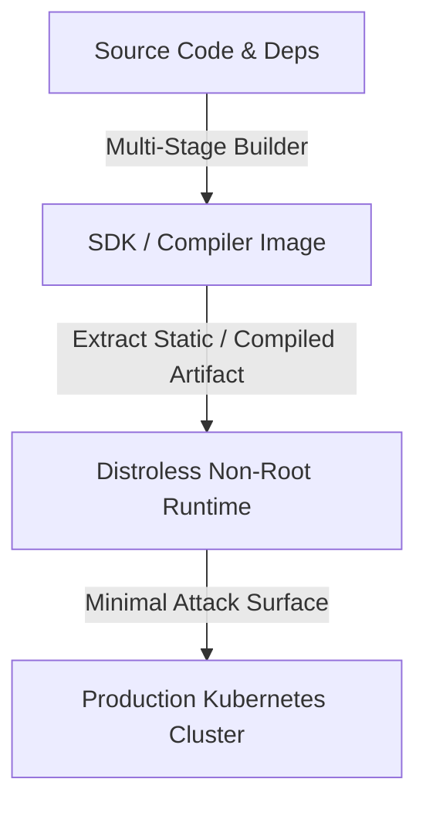

# ADR-001: Standard Cloud-Native Architecture & Container Hardening

- **Status:** ACCEPTED ✅
- **Deciders:** Berat Erol Çelik (Principal Platform Engineer)
- **Date:** 2026-09-01
- **Technical Scope:** Docker, Kubernetes, Linux Sysctl, Security Baseline

## Context & Problem Statement
In production-grade containerized systems, oversized images increase deployment latency and expand CVE vulnerability attack surfaces. Running containers as root poses privilege escalation risks inside Kubernetes pods.

## Decision Drivers
- Minimal container image footprint (< 100MB runtime).
- Zero critical/high CVEs in base images.
- Non-root user execution enforcement (UID 10001+).
- Graceful Linux signal handling (`SIGTERM`/`SIGQUIT`) without zombie process reaping.

## Considered Options
1. Standard Debian/Alpine base images.
2. Google Container Tools Distroless base images (`gcr.io/distroless`).
3. Scratch base images with static binaries.

## Decision Outcome
Chosen option: **Distroless & Multi-Stage Builds**, because distroless eliminates package managers, shells, and runtime toolchains while maintaining necessary glibc/ca-certificates compatibility.

## Consequences
### Positive
- Docker build cache optimizes subsequent CI/CD runs.
- Container vulnerability scans (Trivy, Grype) return zero CVEs.
- Conforms to CIS Kubernetes Benchmarks.

### Negative
- Debugging running containers requires ephemeral debug containers (`kubectl debug`) as no interactive shell (`/bin/sh`) is present.
