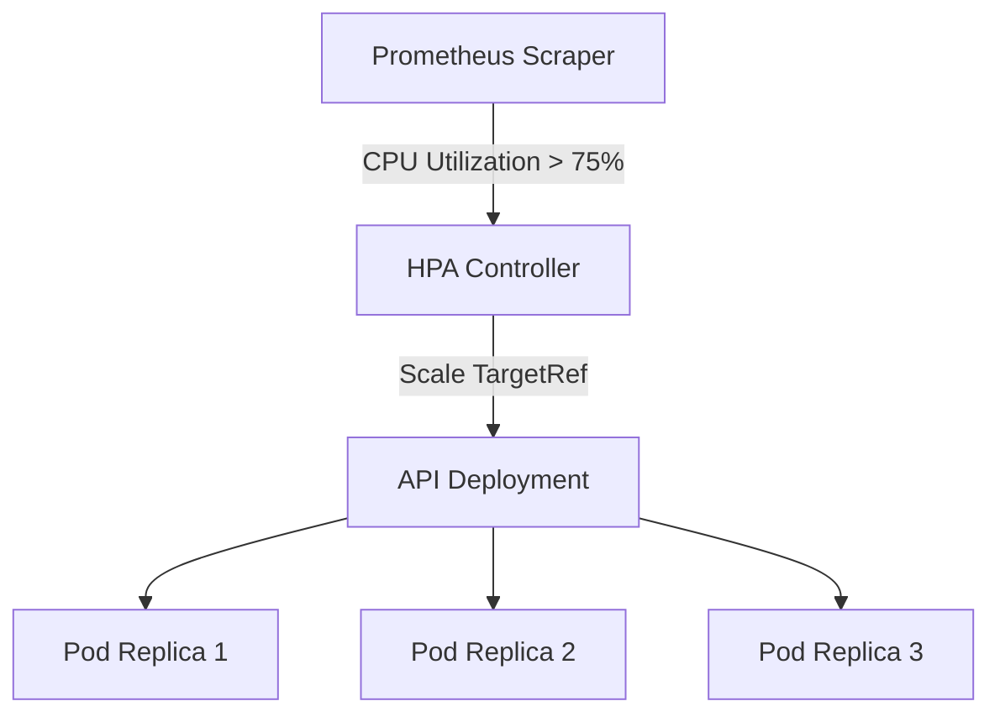

# Kubernetes HPA CPU Threshold Scaling

> **Date:** 2026-09-22 | **Theme:** Kubernetes & Cloud-Native Architecture Decision Record (ADR) | **Category:** Kubernetes

## Overview
Horizontal Pod Autoscaler configuration targeting 75% average CPU utilization.

## Architecture Diagram


## Implementation
```yaml
apiVersion: autoscaling/v2
kind: HorizontalPodAutoscaler
metadata:
  name: api-hpa
spec:
  scaleTargetRef:
    apiVersion: apps/v1
    kind: Deployment
    name: api
  minReplicas: 2
  maxReplicas: 10
  metrics:
  - type: Resource
    resource:
      name: cpu
      target:
        type: Utilization
        averageUtilization: 75
```
