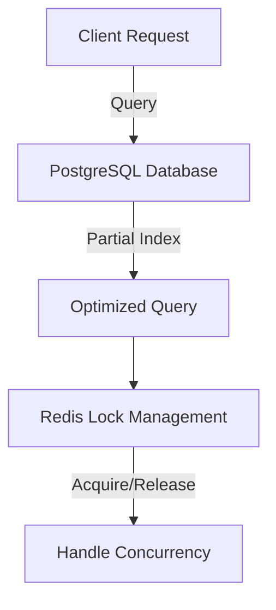

# Optimizing Query Performance with Partial Indexes and Distributed Locks

> **Date:** 2026-09-11 | **Theme:** PostgreSQL & Redis Data Systems | **Category:** PostgreSQL

## Overview
Using partial indexes in PostgreSQL allows for significant performance improvements on queries that filter based on specific conditions, such as active users. In addition, leveraging Redis for distributed locks with TTL ensures that our system maintains data integrity and prevents race conditions when multiple services are accessing shared resources.

## Architecture Diagram


## Implementation
```sql
CREATE INDEX idx_active_users ON users (last_login) WHERE active = true;

EXPLAIN ANALYZE SELECT * FROM users WHERE last_login > NOW() - INTERVAL '30 days' AND active = true;

-- Redis distributed lock implementation
import redis
import time

def acquire_lock(client, lock_name, timeout):
    identifier = str(uuid.uuid4())
    end = time.time() + timeout
    while time.time() < end:
        if client.set(lock_name, identifier, nx=True, ex=timeout):
            return identifier
    return False

-- Release lock
def release_lock(client, lock_name, identifier):
    script = "if redis.call('get', KEYS[1]) == ARGV[1] then return redis.call('del', KEYS[1]) else return 0 end"
    return client.eval(script, 1, lock_name, identifier)
```
