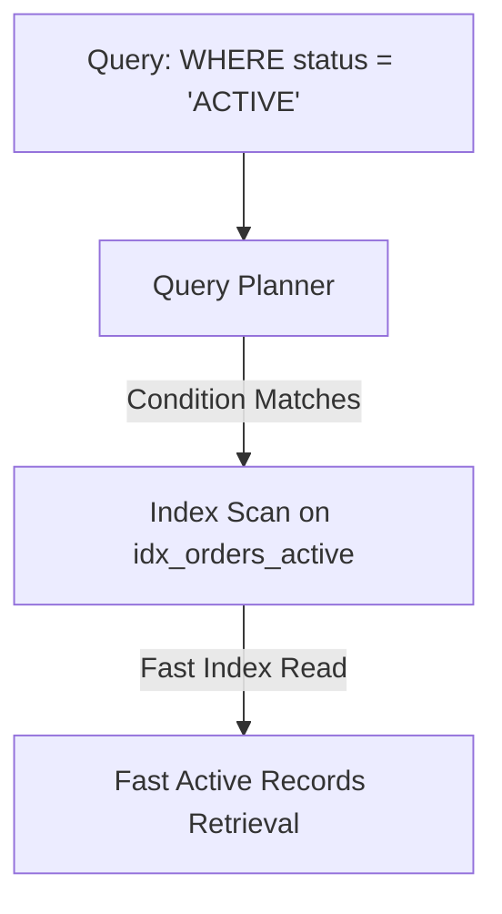

# PostgreSQL Indexing: Partial Index

> **Date:** 2026-09-11 | **Theme:** PostgreSQL & Redis Data Systems | **Category:** PostgreSQL

## Overview
Reducing index size and maintenance overhead by indexing only active order records.

## Architecture Diagram


## Implementation
```sql
CREATE INDEX idx_orders_active_created_at
ON orders (created_at DESC)
WHERE status = 'ACTIVE';
```
