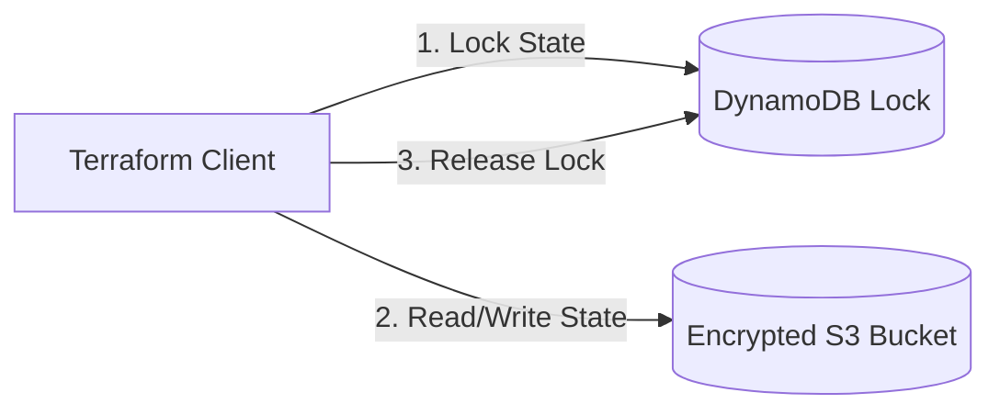

# Terraform Remote S3 State with DynamoDB Lock

> **Date:** 2026-09-12 | **Theme:** Terraform & Cloud IaC | **Category:** Terraform

## Overview
Securing cloud infrastructure state with encrypted remote storage and distributed atomic locking.

## Architecture Diagram


## Implementation
```hcl
terraform {
  backend "s3" {
    bucket         = "corp-tfstate-prod"
    key            = "global/s3/terraform.tfstate"
    region         = "eu-central-1"
    dynamodb_table = "terraform-locks"
    encrypt        = true
  }
}
```
