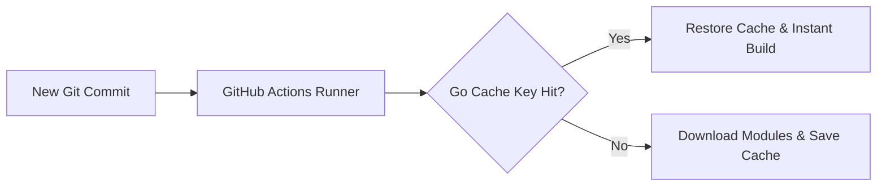

# GitHub Actions Dependency Cache Optimization

> **Date:** 2026-09-20 | **Theme:** CI/CD & Observability | **Category:** CI-CD

## Overview
Accelerating continuous integration pipelines by caching external module dependencies using lockfile hashing.

## Architecture Diagram


## Implementation
```yaml
- name: Cache Go modules
  uses: actions/cache@v4
  with:
    path: ~/go/pkg/mod
    key: ${{ runner.os }}-go-${{ hashFiles('**/go.sum') }}
    restore-keys: |
      ${{ runner.os }}-go-
```
