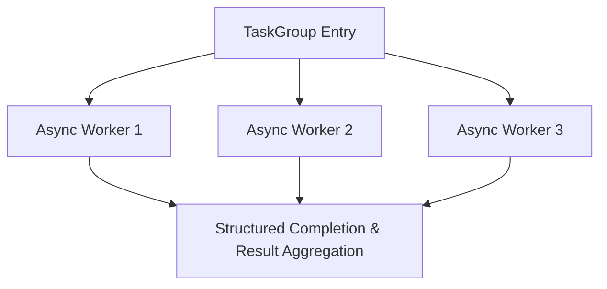

# Python AsyncIO Structured TaskGroup

> **Date:** 2026-09-24 | **Theme:** Python & FastAPI Architecture | **Category:** Python

## Overview
Managing concurrent asynchronous tasks with structured concurrency and exception safety.

## Architecture Diagram


## Implementation
```python
async def fetch_all(urls):
    async with asyncio.TaskGroup() as tg:
        tasks = [tg.create_task(fetch(u)) for u in urls]
    return [t.result() for t in tasks]
```
