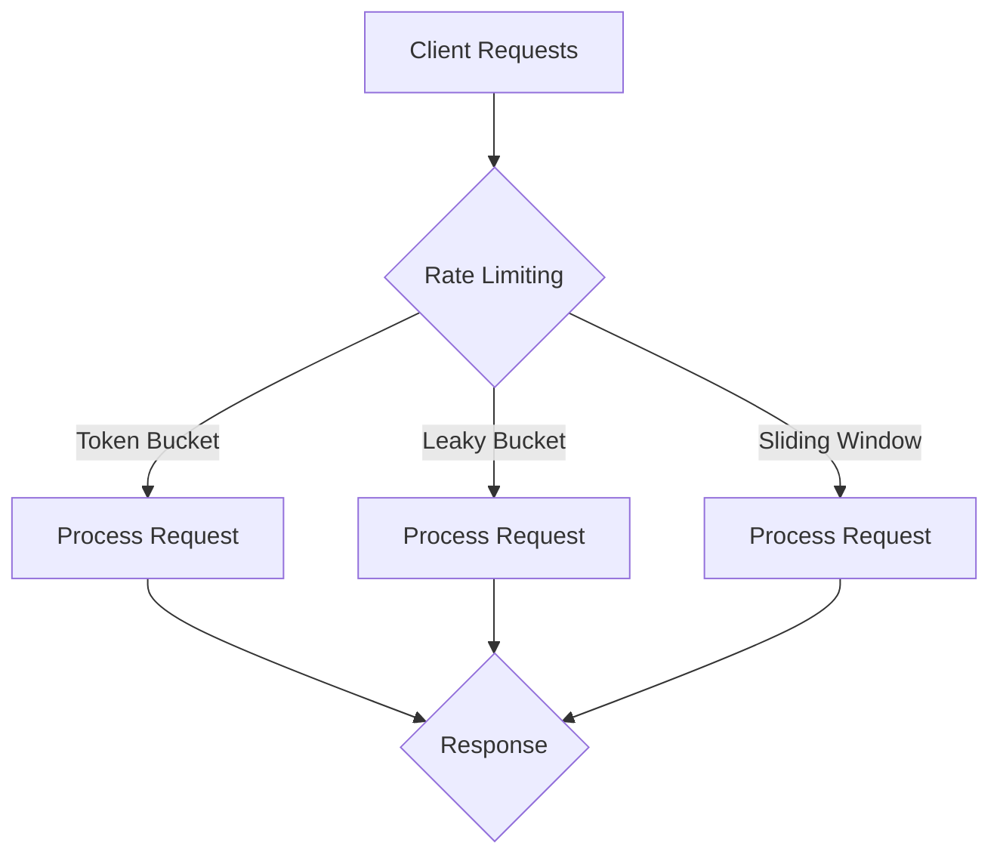

*Kapak: Minimalist flat tech illustration for article: Rate Limiting at Scale: Token Bucket vs Leaky Bucket vs Sliding Window, category System Design, modern, clean, 16:9, no text* (ekte gönderildi)
# Rate Limiting at Scale: Token Bucket vs Leaky Bucket vs Sliding Window — Lessons from Stripe & Cloudflare

Effective rate limiting is crucial for maintaining service reliability and performance in modern distributed systems. As applications scale, understanding the nuances between different rate limiting algorithms—specifically Token Bucket, Leaky Bucket, and Sliding Window—becomes essential for senior engineers tasked with building robust APIs. This article dissects these methodologies, drawing insights from industry leaders like Stripe and Cloudflare.

## TL;DR
- Rate limiting algorithms impact API performance and reliability significantly.
- Token Bucket and Sliding Window provide more nuanced handling of bursts compared to Leaky Bucket.
- Real-world implementations can lead to unexpected performance bottlenecks if not designed carefully.

## Why This Matters
In a high-volume transaction environment, such as Stripe, the need for effective rate limiting is paramount. In 2020, during a notable incident, Stripe experienced a surge in transaction requests due to a major e-commerce event, resulting in a 50% spike in API calls. Without robust rate limiting mechanisms, their systems would have been overwhelmed, leading to degraded performance and potential service outages. This incident illustrates how poorly managed rate limiting not only affects customer experience but also could lead to significant revenue loss.

Similarly, Cloudflare experienced a denial-of-service attack that targeted its API endpoints, pushing it to the limits of standard request handling capabilities. By implementing sophisticated rate limiting strategies, Cloudflare not only protected its infrastructure but also ensured that legitimate users maintained access to their services. In both cases, effective rate limiting strategies enabled these companies to sustain operations under extreme conditions, emphasizing the critical nature of this component in system design.

## 1. Deep Dive: Token Bucket
The Token Bucket algorithm is a dynamic approach to rate limiting that allows burst traffic while maintaining a steady average rate. It employs a metaphor of tokens; a predefined number of tokens are stored in a “bucket” that corresponds to the maximum allowed rate of requests. Each incoming request consumes a token if available. If the bucket is empty, further requests are denied until tokens are replenished, typically at a constant rate. This design permits bursts of traffic, as long as the overall rate conforms to the defined limits over time.

In terms of architecture, the Token Bucket maintains a simple data structure for storing the current token count and the time of the last request. When a request arrives, the algorithm checks if a token is available. If a token can be consumed, the request proceeds; if not, it is throttled. This efficiency is particularly useful in environments where traffic patterns are unpredictable, allowing for higher tolerance of transient spikes.

### Trade-offs:
- **Pros**:
  - Allows burst handling, making it suitable for interactive applications where latency is critical.
  - Easy to implement and understand.
  - Provides flexibility through adjustable token refill rates.

- **Cons**:
  - Requires careful tuning of token generation rate for optimal performance.
  - Can lead to throttling if bursts exceed the bucket's capacity frequently.
  - May require synchronization mechanisms in distributed systems to prevent race conditions when accessing the token bucket.

## 2. Deep Dive: Leaky Bucket
The Leaky Bucket algorithm takes a slightly different approach. It enforces a strict output rate by treating incoming requests as water pouring into a bucket. The bucket has a hole at the bottom that allows water to leak out at a constant rate. If the bucket overfills (i.e., if requests come in too fast), the excess requests are discarded or delayed. This method emphasizes maintaining a consistent output rate, limiting the maximum burst size effectively.

Architecturally, the Leaky Bucket algorithm uses a similar data structure as the Token Bucket but focuses on ensuring that requests are processed at a steady rate rather than allowing sudden bursts. Each incoming request is enqueued, and they are dequeued at a steady rate. This can result in a more predictable user experience, especially for APIs where latency is less critical but stability is crucial.

### Trade-offs:
- **Pros**:
  - Predictable processing rate prevents system overload, making it suitable for critical applications.
  - Simple to implement and ensures smooth request flow.
  - Effective in environments with steady request rates.

- **Cons**:
  - Does not handle burst traffic well, which can lead to dropped requests during high-load periods.
  - Fixed leak rate could lead to underutilization of resources during low traffic conditions.
  - Less flexibility in accommodating dynamic workloads compared to the Token Bucket.

## 3. Head-to-Head Comparison
| Feature              | Token Bucket                            | Leaky Bucket                          | Sliding Window                          |
|----------------------|----------------------------------------|---------------------------------------|-----------------------------------------|
| Burst Handling        | High (allows bursts)                  | Low (strict rate)                     | Moderate (depends on implementation)   |
| Latency               | Variable (based on traffic)           | Low (constant flow)                   | Moderate (depends on window size)      |
| Complexity            | Moderate (requires token management)  | Low (simple queuing)                  | High (requires tracking windows)       |
| Use Cases             | Interactive APIs, gaming               | Streaming services, payment gateways   | APIs with variable traffic patterns     |
| Distributed State     | Needs coordination for tokens          | Less sensitive, simpler state sharing  | Complex state management required       |
| Failure Modes        | Token depletion, race conditions       | Queue overflow, dropped requests       | Mismanaged windows leading to over/under limits |
| Performance          | Efficient under burst conditions       | Consistent under sustained load        | Flexible with correct tuning            |

## 4. Architecture Diagram


This diagram illustrates the flow of client requests through various rate limiting strategies. Each request enters the rate limiting component, which routes it to either the Token Bucket, Leaky Bucket, or Sliding Window approach, depending on the architecture's configuration. Each path then leads to processing the request. The outputs from all strategies converge at the response node, ensuring that responses are delivered back to the client efficiently. Redis often plays a central role in managing state across distributed systems, allowing for seamless coordination and high availability despite varying rates of incoming requests. It is crucial in maintaining the token counts or bucket statuses across multiple service instances, ensuring consistency and reliability in rate limiting.

## 5. Production Code Example 1: Token Bucket in Python
```python
import time
import threading

class TokenBucket:
    def __init__(self, capacity: int, refill_rate: float):
        self.capacity = capacity       # Maximum tokens
        self.tokens = capacity         # Current token count
        self.refill_rate = refill_rate # Tokens added per second
        self.last_refill = time.monotonic()  # Last refill time
        self.lock = threading.Lock()   # Thread safety

    def refill(self):
        current_time = time.monotonic()
        elapsed_time = current_time - self.last_refill
        new_tokens = elapsed_time * self.refill_rate
        self.tokens = min(self.capacity, self.tokens + new_tokens)
        self.last_refill = current_time

    def acquire(self):
        with self.lock:
            self.refill()  # Refill tokens
            if self.tokens > 0:
                self.tokens -= 1  # Consume a token
                return True        # Request granted
            else:
                return False       # Request denied

# Example usage
bucket = TokenBucket(10, 1)  # 10 tokens, refill rate of 1 token/sec
for _ in range(15):
    if bucket.acquire():
        print('Request granted')
    else:
        print('Request denied')
    time.sleep(0.5)  # Simulate request interval
```

This implementation of a Token Bucket in Python demonstrates the core mechanics involved in the rate-limiting strategy. The class constructor initializes the bucket's capacity and the token refill rate, with the last refill time recorded. The `refill` method calculates how many tokens can be added based on the elapsed time since the last refill, ensuring that the token count does not exceed the bucket's capacity. The `acquire` method handles request processing; it first calls the `refill` method and checks if a token is available. If available, it decrements the token count and indicates that the request is granted, otherwise, it denies the request. This implementation takes into account thread safety through the use of a `threading.Lock`, allowing concurrent requests to be processed safely. In practice, edge cases such as clock skew can affect the timing of token refills, necessitating careful testing and observation of system behavior under load.

## 6. Production Code Example 2: Leaky Bucket in Python
```python
import time
import threading
from collections import deque

class LeakyBucket:
    def __init__(self, capacity: int, leak_rate: float):
        self.capacity = capacity      # Maximum capacity
        self.queue = deque()          # Queue for requests
        self.leak_rate = leak_rate    # Leak rate (requests per second)
        self.last_leak = time.monotonic()  # Last time a request was processed
        self.lock = threading.Lock()   # Thread safety

    def leak(self):
        current_time = time.monotonic()
        elapsed_time = current_time - self.last_leak
        leaked_requests = elapsed_time * self.leak_rate
        while leaked_requests > 0 and self.queue:
            self.queue.popleft()  # Process a request
            leaked_requests -= 1
        self.last_leak = current_time

    def add_request(self, request):
        with self.lock:
            self.leak()  # Leak old requests
            if len(self.queue) < self.capacity:
                self.queue.append(request)  # Enqueue request
                return True  # Request added successfully
            else:
                return False  # Bucket overflow

# Example usage
bucket = LeakyBucket(5, 1)  # Capacity of 5, leak rate of 1 request/sec
for i in range(10):
    if bucket.add_request(f'Request {i}'):  # Simulating requests
        print(f'Added Request {i}')
    else:
        print(f'Request {i} dropped')
    time.sleep(0.8)  # Simulate request arrival rate
```

This Leaky Bucket implementation demonstrates how requests are managed to ensure a stable output rate. The class initializes with a specified capacity and a leak rate. The `leak` method processes requests at the defined leak rate, effectively removing them from the queue. The `add_request` method is responsible for adding new requests to the queue while ensuring it does not exceed capacity. Similar to the Token Bucket example, this implementation is thread-safe, allowing multiple threads to safely manage access to the bucket. Edge cases to consider include managing overflow conditions where requests exceed the bucket's capacity, as well as optimizing the leak rate to match the traffic pattern expected in a production environment. 

## 7. Real-World Use Cases
- **Stripe**: Stripe uses rate limiting to protect its API from abuse while ensuring a smooth payment experience for legitimate users. They have tailored their token bucket configuration to handle bursts during high-traffic events, such as Black Friday sales, effectively balancing load and maintaining availability.
- **Cloudflare**: Cloudflare employs rate limiting to mitigate DDoS attacks and ensure service continuity. Their architecture implements a sliding window technique to allow for more dynamic handling of request patterns, adapting in real time to changing traffic scenarios and preserving user access during attacks.
- **Netflix**: For Netflix, rate limiting is essential in managing streaming quality and user experience. Implementing the leaky bucket algorithm allows them to stabilize request rates for video content delivery, ensuring a smooth experience even during peak viewing times without overwhelming their infrastructure.

## 8. Failure Modes & Pitfalls
- **Token Depletion**: Under heavy load, tokens may be depleted, leading to throttled requests. **Mitigation**: Monitor token usage and adjust refill rates dynamically.
- **Race Conditions**: Concurrent access to token counts in distributed systems can lead to inconsistent states. **Mitigation**: Use distributed locks or atomic operations when managing tokens.
- **Bucket Overflow**: In the leaky bucket implementation, high burst rates can lead to dropped requests. **Mitigation**: Adjust leak rates based on traffic patterns to accommodate sudden spikes.
- **Mismanaged Windows**: In sliding window algorithms, poor window size settings can lead to over or under-limiting requests. **Mitigation**: Regularly analyze traffic and adjust window configurations to match real-world usage effectively.

## 9. When to Choose Which
To determine the appropriate rate limiting algorithm, consider the following:
- **Token Bucket**: Opt for this if your application needs to accommodate burst traffic while ensuring an average rate is maintained. It's particularly useful for interactive applications where user experience is paramount.
- **Leaky Bucket**: Choose this for applications requiring a steady request rate and predictable performance. This model is ideal for services where stability is more critical than accommodating bursts.
- **Sliding Window**: If your application experiences variable traffic patterns and you need to adapt dynamically, this hybrid approach can help. Implement this when you require both burst handling and a steady processing rate.

## Conclusion
In summary, understanding the nuances of rate limiting techniques is essential for building resilient APIs in today's distributed systems. The Token Bucket and Sliding Window algorithms provide flexibility in handling bursts, while the Leaky Bucket offers stability and predictability. Senior engineers should carefully evaluate their application’s needs and traffic patterns to choose the best approach. For your next project, consider conducting load-testing with different algorithms to identify the best fit for your environment and ensure optimal performance under various conditions.

### Actionable Next Step
Implement a prototype of each rate limiting strategy in a test environment. Conduct performance benchmarks to compare their behaviors under simulated load conditions, then integrate the best-performing algorithm into your production systems.

---
### References
- 

---

### 📊 Ek Kaynaklar
| Kaynak | Link | Açıklama |
|---|---|---|
| GitHub Repo | https://github.com/BerattCelikk/daily-engineering-log | Günlük mühendislik notları |
| Kaggle Dataset | https://www.kaggle.com/datasets/beraterolelk | AI datasetleri |

### 🏷️ Etiketler
`Rate Limiting` `System Design` `API` `Distributed Systems`