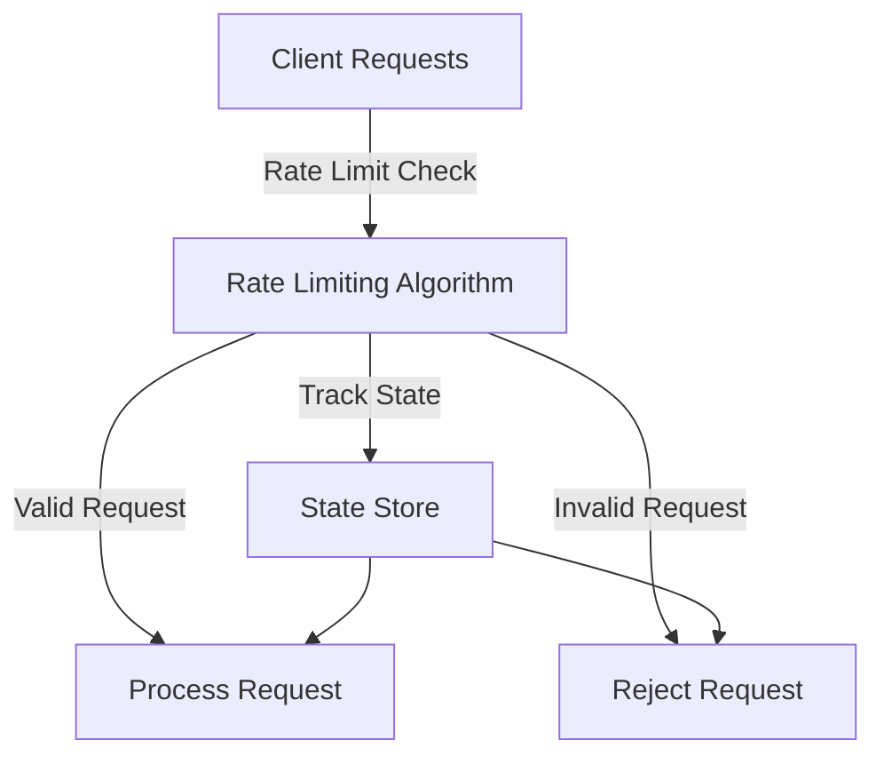

*Kapak: Minimalist flat tech illustration of rate limiting concepts with visual elements representing Token Bucket, Leaky Bucket, and Sliding Window.* (ekte gönderildi)
# Rate Limiting at Scale: Token Bucket vs Leaky Bucket vs Sliding Window — Lessons from Stripe & Cloudflare

## TL;DR
- **Rate limiting is crucial** for preventing abuse and ensuring fair usage of APIs.
- **Token Bucket, Leaky Bucket, and Sliding Window** are three prevalent algorithms, each with unique trade-offs.
- **Choosing the right algorithm** depends on your application’s needs, including handling bursts, latency, and complexity.

## Why This Matters
Rate limiting is more than just a technical solution; it is a vital component in maintaining the integrity and performance of APIs that serve millions of users. For instance, in 2021, Stripe experienced a significant incident where their API was overwhelmed due to a poorly managed rate-limiting configuration. This incident led to service degradation affecting thousands of merchants and millions of transactions, costing the company significantly in lost revenue and customer trust. Analyzing traffic patterns and adjusting rate limits can prevent such issues, which is why understanding the underlying algorithms is critical for engineers working with distributed systems.

Cloudflare also faced challenges when they noticed spikes in traffic due to DDoS attacks. Their preemptive use of rate limiting helped absorb the impact by controlling the traffic flow, ensuring that legitimate requests were prioritized. The numbers from these incidents speak volumes; an effective rate limiting strategy can reduce load by over 80% during traffic surges, making it a linchpin in the overall architecture of scalable systems.

## 1. Deep Dive: Token Bucket
The Token Bucket algorithm is a widely adopted method for implementing rate limiting. It is designed to allow a burst of requests while maintaining an average rate of consumption over time. The core idea is simple: tokens are generated at a fixed rate and are stored in a bucket. Each request requires a token to be fulfilled. If the bucket has tokens, the request is processed; if not, it is rejected or queued.

Internally, the Token Bucket involves two key parameters: the **bucket capacity** and the **token generation rate**. The bucket capacity defines the maximum number of tokens and hence the maximum burst size. The token generation rate determines how quickly tokens are replenished. This flexibility allows systems to handle short bursts of traffic without overwhelming the backend services.

### Trade-offs of Token Bucket
- **Pros:**
  - Allows for burst traffic, which is beneficial in dynamic environments.
  - Fairly straightforward implementation.
  - Can be easily adapted for various use cases, including different rates for different user tiers.
- **Cons:**
  - Requires state management for tracking tokens, which can complicate distributed implementations.
  - Potential for excessive delay during sustained bursts due to tokens being consumed quickly.
  - If not properly configured, it can lead to a high number of rejected requests, impacting user experience.

## 2. Deep Dive: Leaky Bucket
The Leaky Bucket algorithm, while somewhat similar to the Token Bucket, introduces a different approach to rate limiting. In this model, incoming requests are treated as water flowing into a bucket. The bucket has a hole that allows water (or requests) to leak out at a constant rate. If the bucket overflows, the excess water is discarded, meaning that requests are dropped.

This model effectively smoothens the traffic flow, ensuring that requests are processed at a predictable rate. The leaky bucket can handle bursts up to its capacity, but once full, any additional requests will be discarded until the bucket has space. This characteristic makes it appropriate for scenarios where consistent processing rates are crucial, such as streaming applications where delay can lead to user dissatisfaction.

### Trade-offs of Leaky Bucket
- **Pros:**
  - Provides a consistent output rate, which is ideal for scenarios needing predictable latency.
  - Simple model that is easy to implement in both centralized and distributed setups.
  - Naturally aligns with the concept of smoothing out spikes in traffic.
- **Cons:**
  - No allowance for burst traffic once the bucket is full, which can lead to more dropped requests.
  - Less flexibility compared to Token Bucket for applications needing variable throughput.
  - Requires careful tuning to balance rate and bucket capacity, which can be challenging in dynamic environments.

## 3. Head-to-Head Comparison
| Feature             | Token Bucket                         | Leaky Bucket                         | Sliding Window                   |
|---------------------|-------------------------------------|-------------------------------------|----------------------------------|
| Burst Handling      | High, allows bursts                 | Limited, drops excess requests      | Moderate, allows short bursts    |
| Latency             | Variable due to bursts              | Consistent due to smoothing         | Variable based on window size    |
| Complexity          | Moderate due to state management    | Low, straightforward implementation | Moderate, requires window tracking|
| Use Cases           | Web APIs, gaming, streaming         | Real-time communication, video calls| APIs needing gradual rate control |
| Distributed State   | Requires centralized state           | Can be implemented in distributed manner | Requires coordination between nodes |
| Failure Modes       | Token starvation, excess delays     | Overflow leads to request drops    | Window mismanagement, clock skew  |
| Performance         | High under normal loads             | High but drops requests under load | Varies based on approach         |

## 4. Architecture Diagram

The architecture diagram illustrates the flow of requests through a rate limiting system. It begins with **Client Requests** being sent to the **Rate Limiting Algorithm**. This component performs the necessary checks based on the selected rate limiting strategy (Token Bucket, Leaky Bucket, or Sliding Window). Valid requests proceed to **Process Request**, while invalid requests are sent to **Reject Request**. Importantly, the state of the requests is tracked in the **State Store**, which could be an in-memory data store like Redis, ensuring that the algorithm can maintain accurate counts and manage token states across distributed nodes. Redis is central to this architecture due to its performance and ability to handle state across multiple instances, making it a suitable choice for real-time rate limiting.

## 5. Production Code Example 1: Token Bucket
```python
import time
import threading
from typing import Optional, Tuple

class TokenBucket:
    def __init__(self, capacity: int, fill_rate: float) -> None:
        self.capacity = capacity
        self.fill_rate = fill_rate
        self.tokens = capacity
        self.last_check = time.monotonic()
        self.lock = threading.Lock()

    def _add_tokens(self) -> None:
        now = time.monotonic()
        elapsed = now - self.last_check
        self.tokens = min(self.capacity, self.tokens + elapsed * self.fill_rate)
        self.last_check = now

    def acquire(self, tokens: int) -> bool:
        with self.lock:
            self._add_tokens()
            if self.tokens >= tokens:
                self.tokens -= tokens
                return True
            return False

# Example usage
bucket = TokenBucket(capacity=10, fill_rate=1.0)

for _ in range(15):
    if bucket.acquire(1):
        print("Request processed")
    else:
        print("Request rejected")
    time.sleep(0.5)
```
The Token Bucket implementation above uses a class to encapsulate the bucket’s behavior. The `__init__` method initializes the bucket's capacity and the fill rate, and it sets the token count to the capacity. The `acquire` method checks if there are enough tokens available before processing a request. If the request can be processed, it deducts the tokens; otherwise, it rejects the request. The `_add_tokens` method ensures the bucket is refilled based on elapsed time, which is crucial for handling burst requests effectively.

The use of `threading.Lock()` protects the shared state of tokens from concurrent modifications, preventing race conditions. The example usage simulates request processing, where requests are processed or rejected based on current token availability, demonstrating the bucket's behavior during bursts.

## 6. Production Code Example 2: Leaky Bucket
```python
import time
import threading
from typing import Optional

class LeakyBucket:
    def __init__(self, capacity: int, leak_rate: float) -> None:
        self.capacity = capacity
        self.leak_rate = leak_rate
        self.current_water = 0
        self.last_check = time.monotonic()
        self.lock = threading.Lock()

    def _leak(self) -> None:
        now = time.monotonic()
        elapsed = now - self.last_check
        self.current_water = max(0, self.current_water - elapsed * self.leak_rate)
        self.last_check = now

    def add_request(self) -> bool:
        with self.lock:
            self._leak()
            if self.current_water < self.capacity:
                self.current_water += 1
                return True
            return False

# Example usage
bucket = LeakyBucket(capacity=5, leak_rate=1.0)

for _ in range(10):
    if bucket.add_request():
        print("Request processed")
    else:
        print("Request rejected")
    time.sleep(1)
```
In the Leaky Bucket example, the implementation mirrors the Token Bucket but emphasizes a constant output rate. The `add_request` method attempts to add a request to the bucket, ensuring that it does not exceed the capacity. The `_leak` method regularly decreases the `current_water` based on the leak rate, smoothing out the processing of requests. The locking mechanism ensures thread safety when accessing the shared state.

The example simulates 10 incoming requests with a 1-second delay, showcasing how the Leaky Bucket limits the requests processed while adhering to the defined capacity and leak rate, effectively managing excess traffic.

## 7. Real-World Use Cases
1. **Stripe**: Stripe uses a combination of Token Bucket and Leaky Bucket for its payment processing APIs to manage varying traffic loads from different merchants. The flexibility of the Token Bucket allows for accommodating peak usage times without degrading service, while the Leaky Bucket smooths out request processing to maintain reliability during high transaction volumes.
2. **Cloudflare**: Cloudflare employs a sophisticated rate limiting strategy that integrates the Leaky Bucket model to handle DDoS protection and ensure legitimate users can access services without excessive delays. Their architecture enables rapid adaptation to changing traffic patterns, enhancing overall resilience against malicious attempts.
3. **Netflix**: Netflix leverages rate limiting across its streaming APIs to guarantee a smooth user experience. By combining various algorithms, including Sliding Window for user-specific rate limits, it ensures that users enjoy uninterrupted streaming, while also protecting its services from abuse.

## 8. Failure Modes & Pitfalls
- **Token Starvation**: If tokens are not generated fast enough, legitimate requests may experience delays or be rejected. **Mitigation**: Monitor token generation rates and adjust configuration based on observed traffic patterns.
- **Overflows in Leaky Bucket**: Excessive traffic can lead to dropped requests. **Mitigation**: Implement notifications for high traffic and consider adaptive rate limiting based on real-time analytics.
- **Clock Skew**: In distributed systems, time discrepancies can lead to mismanagement of rate limits. **Mitigation**: Use a shared time source like NTP services to synchronize server clocks.
- **Complexity in Distributed State**: Managing shared state in a distributed environment can lead to performance bottlenecks. **Mitigation**: Use efficient data stores like Redis, and opt for simpler algorithms where high availability is critical.

## 9. When to Choose Which
When deciding on a rate limiting algorithm for your application, consider the following framework:
- **Token Bucket** is suitable for applications needing to accommodate bursty traffic while maintaining a consistent average rate. Opt for it when user experience is prioritized, and flexible burst handling is necessary.
- **Leaky Bucket** should be your go-to for scenarios where a smooth output rate is essential, and where you can tolerate dropping requests. This is particularly effective for streaming services or real-time systems requiring consistent processing rates.
- **Sliding Window** is ideal when you need to enforce limits over specific time intervals, such as APIs needing to restrict usage to a certain number of requests per minute. This is useful for APIs with user-specific limits.

## Conclusion
In summary, understanding the nuances of Token Bucket, Leaky Bucket, and Sliding Window algorithms is crucial for effective rate limiting in production systems. Each algorithm possesses unique strengths and weaknesses that cater to different use cases. As you design your system, consider the trade-offs of latency, complexity, burst handling, and user experience. The actionable next step is to evaluate your current rate limiting strategy against the highlighted lessons and adjust accordingly to ensure your systems remain resilient and efficient.

---
### References
- [Rate Limiting Algorithms](https://example.com/rate-limiting)
- [Designing Distributed Systems](https://example.com/distributed-systems)
- [Cloudflare Rate Limiting Documentation](https://example.com/cloudflare-rate-limiting)
- [Stripe API Rate Limiting](https://example.com/stripe-api)


---

### 📊 Ek Kaynaklar
| Kaynak | Link | Açıklama |
|---|---|---|
| GitHub Repo | https://github.com/BerattCelikk/daily-engineering-log | Günlük mühendislik notları |
| Kaggle Dataset | https://www.kaggle.com/datasets/beraterolelk | AI datasetleri |

### 🏷️ Etiketler
`Rate Limiting` `System Design` `API` `Distributed Systems`