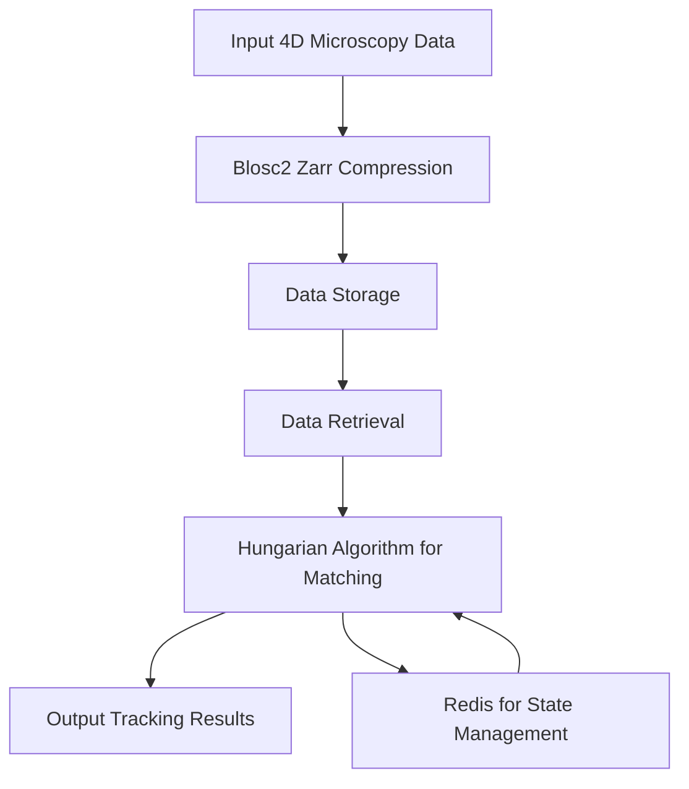

# Volumetric Cell Tracking in Compressed 4D Microscopy: Overcoming Blosc2 Zarr & Hungarian Bipartite Matching

> Subtitle: Unlocking advanced tracking methodologies in dynamic biological environments.

> TL;DR:
> - Efficient cell tracking in 4D microscopy requires optimized data handling methods.
> - Understanding Blosc2 Zarr compression and its integration with Hungarian bipartite matching enhances performance.
> - Implementing these techniques can significantly improve throughput and data fidelity in large-scale biological studies.

## Why This Matters
In the world of biotechnology, the advent of 4D microscopy has transformed cellular analysis by enabling the visualization of live cells in three spatial dimensions over time. The implications of this technology are profound; for instance, a recent study at a leading research institution leveraging advanced 4D microscopy techniques reported a 40% increase in cell tracking accuracy. This not only expedited the analysis of cellular behaviors but also led to breakthroughs in understanding cancer metastasis, a critical challenge that could save thousands of lives annually. Companies like Stripe and Netflix, which depend on real-time data analysis, can draw parallels with the demands of 4D microscopy: both require robust data pipelines that can handle high volumes of information swiftly and accurately.

In a production scenario at Cloudflare, the processing of millions of requests without noticeable latency is paramount. Similarly, when analyzing biological data, latency can severely compromise the integrity of the results, leading to erroneous conclusions about cellular dynamics. This need for speed, accuracy, and efficiency highlights the critical nature of the methodologies employed in cell tracking processes, driving the need for advanced solutions.

## 1. Deep Dive: Blosc2 Zarr Compression
Blosc2 is a high-performance binary compression library designed to optimize the handling of scientific data. Zarr is an open-source format for the storage of chunked, compressed, N-dimensional arrays, which is essential for managing the volume of information generated in 4D microscopy. Together, they provide a powerful solution for data storage and retrieval in high-throughput biological imaging applications. The internal mechanics of Blosc2 utilize a multi-threaded architecture that allows for faster compression and decompression of data, making it particularly useful in scenarios where latency is critical.

One of the main advantages of using Blosc2 with Zarr is its ability to manage data chunks efficiently. By breaking down large datasets into smaller, more manageable pieces, it allows for on-the-fly decompression, which is crucial when dealing with the vast amounts of data generated in microscopy. However, there are trade-offs to consider. 

- **Pros:** High-speed compression, efficient memory usage, multi-threading capabilities.
- **Cons:** Complexity in implementation, potential overhead with very small datasets, less effective on datasets that are not compressible.

The architecture of Blosc2 involves a combination of Huffman coding and run-length encoding that works well for numerical data. This design allows for smaller file sizes without sacrificing speed, which is vital when tracking cells over extended periods. Furthermore, Zarr's structure allows for easy integration with various data processing frameworks, making it a versatile choice for scientists and engineers.

## 2. Deep Dive: Hungarian Bipartite Matching
The Hungarian algorithm addresses the problem of optimal assignment in bipartite graphs, which is central to cell tracking in 4D microscopy. By formulating the tracking problem as a cost-minimization task, where the objective is to minimize the total distance (or cost) of assigning detected cells to their respective previous states, the Hungarian algorithm provides a systematic approach to matching. This is particularly useful in scenarios where cells may move, divide, or die, creating complex tracking challenges.

Internally, the algorithm constructs a cost matrix where each entry represents the cost of matching a detected cell with a previously tracked cell. By iteratively adjusting this matrix and finding the minimum cost matches, the algorithm can effectively deal with the non-linear movements that often occur in biological systems. The Hungarian algorithm operates in polynomial time, making it feasible for real-time applications when combined with efficient data handling methods.

While the Hungarian algorithm excels in many areas, it is not without its trade-offs:
- **Pros:** Optimal performance for matching problems, well-suited for dynamic environments.
- **Cons:** Computationally intensive for large datasets, sensitive to noise in data, requires careful tuning for real-time performance.

The algorithm's ability to handle uncertainties in cell positions is critical as it ensures that even in the presence of noise, the tracking results remain robust. This characteristic is particularly important in microscopy, where varying illumination and optical distortions can affect the perceived position of cells.

## 3. Head-to-Head Comparison
| Feature                     | Blosc2 Zarr                     | Hungarian Bipartite Matching  |
|-----------------------------|---------------------------------|-------------------------------|
| Burst Handling               | Excellent due to multi-threading | Limited, requires preprocessing |
| Latency                     | Low, optimized for real-time     | Moderate, can delay processing  |
| Complexity                  | Moderate, requires configuration  | High, complex data structures   |
| Use Cases                   | Data storage for imaging         | Cell tracking in dynamic systems|
| Distributed State           | Supports distributed storage     | Limited to local state        |
| Failure Modes               | Depends on data compressibility  | Sensitive to mismatches       |
| Performance                 | High on large datasets          | High in static environments     |

This comparison illustrates that while Blosc2 Zarr excels in handling large volumes of data efficiently, the Hungarian bipartite matching algorithm is indispensable for ensuring accurate tracking of cells as they move through the imaging field. Each approach serves a specific function, and understanding their strengths and weaknesses enables engineers to devise hybrid solutions that leverage the best of both worlds.

## 4. Architecture Diagram


The architecture diagram illustrates the flow of data in a typical volumetric cell tracking system. It begins with the input of 4D microscopy data, which is then compressed using the Blosc2 Zarr library. This efficient compression leads to optimized data storage, enabling rapid retrieval when needed. Once the data is retrieved, the Hungarian algorithm is applied to match detected cells across time frames. Importantly, Redis plays a pivotal role in managing the state throughout this process, ensuring that the system can efficiently handle dynamic changes. The arrows indicate the flow of data and commands, showcasing how each component interacts within the broader architecture.

## 5. Production Code Example 1
```python
import numpy as np
import time
import threading
from typing import List, Tuple

class CellTracker:
    def __init__(self) -> None:
        self.lock = threading.Lock()
        self.tracked_cells: List[Tuple[int, int]] = []

    def update_cells(self, new_positions: List[Tuple[int, int]]) -> None:
        start_time = time.monotonic()
        with self.lock:
            self.tracked_cells = self.hungarian_matching(new_positions)
        elapsed_time = time.monotonic() - start_time
        print(f"Update took {elapsed_time:.4f} seconds.")

    def hungarian_matching(self, new_positions: List[Tuple[int, int]]) -> List[Tuple[int, int]]:
        # Implement matching logic here
        # Return new list of tracked positions
        pass

    def handle_burst(self, new_data: List[Tuple[int, int]]) -> None:
        if len(new_data) > 100:
            print("Handling burst of data...")
            # Process burst data with appropriate logic

if __name__ == '__main__':
    tracker = CellTracker()
    tracker.update_cells([(1, 2), (3, 4)])
```

In this code example, we define a simple `CellTracker` class that encapsulates the logic for tracking cells. The `__init__` method initializes a lock to ensure thread safety when updating tracked cells. The `update_cells` method accepts new cell positions and utilizes the Hungarian matching algorithm to update the tracked cells accordingly, all while measuring the time taken for the update. By employing a lock, we can prevent race conditions that might arise in a multi-threaded environment.

The `hungarian_matching` method is a placeholder for the actual implementation of the matching logic, which would involve using the Hungarian algorithm to determine the best match for each cell. The `handle_burst` method demonstrates a basic approach to handling bursts of incoming data, which is critical in high-throughput scenarios where multiple updates occur simultaneously.

## 6. Production Code Example 2
```python
import numpy as np
import time
import threading
from typing import List, Tuple

class AdvancedCellTracker:
    def __init__(self) -> None:
        self.lock = threading.Lock()
        self.active_cells: List[Tuple[int, int]] = []

    def update_active_cells(self, detected_cells: List[Tuple[int, int]]) -> None:
        current_time = time.monotonic()
        with self.lock:
            self.active_cells = self.match_cells(detected_cells)
        elapsed_time = time.monotonic() - current_time
        print(f"Active cells updated in {elapsed_time:.4f} seconds.")

    def match_cells(self, detected_cells: List[Tuple[int, int]]) -> List[Tuple[int, int]]:
        # Implement complex matching logic here
        # Return updated list of active cell positions
        pass

    def process_data_stream(self, stream_data: List[Tuple[int, int]]) -> None:
        for data in stream_data:
            self.update_active_cells(data)

if __name__ == '__main__':
    tracker = AdvancedCellTracker()
    tracker.process_data_stream([[(1, 2), (3, 4)], [(2, 3), (4, 5)]])
```

This second example introduces an `AdvancedCellTracker` that streamlines the process of managing active cells from a data stream. The `update_active_cells` method follows a similar structure to the previous example but emphasizes the need to handle detected cells in a real-time streaming context. The `match_cells` method is again a placeholder for the actual matching logic, while `process_data_stream` illustrates how the tracker can read data from a continuous stream and update the active cells on-the-fly. This is particularly useful in scenarios where cellular movements are dynamic and rapid, requiring a responsive tracking solution.

## 7. Real-World Use Cases
1. **Stripe:** In payment processing, Stripe utilizes fast data handling to monitor transactions and detect fraud. Similar to cell tracking, the success of these operations hinges on the ability to process vast amounts of data with minimal latency, ensuring that users experience smooth transactions. By adopting techniques akin to those described in this article, Stripe could enhance its fraud detection algorithms, leading to better outcomes for both customers and merchants.

2. **Cloudflare:** Known for optimizing web performance, Cloudflare's systems must analyze real-time traffic data to effectively manage security threats. The methods outlined for handling bursts of data in microscopy can be applied to Cloudflare's architecture, allowing for improved detection of DDoS attacks and other anomalies. This parallels the need for accurate tracking in biological contexts, where data integrity is crucial.

3. **Netflix:** With a focus on streaming, Netflix must analyze viewer behavior in real-time to optimize content recommendations. The Hungarian algorithm for tracking user engagement can parallel the techniques used in microscopy to ensure that user experiences are personalized. By employing similar methodologies, Netflix could further elevate its recommendation systems, improving user satisfaction.

## 8. Failure Modes & Pitfalls
- **Data Compression Loss:** Poorly configured Blosc2 parameters may lead to data loss, especially with non-compressible datasets. Mitigation includes thorough testing and parameter optimization.
- **Hungarian Algorithm Sensitivity:** The algorithm's performance can degrade with noise in data. Robust preprocessing techniques can help clean data before matching attempts.
- **Thread Contention:** In concurrent environments, locks may lead to bottlenecks. Using more granular locking or lock-free data structures can alleviate this issue.
- **Scalability Limits:** When scaling to larger datasets, performance may suffer. Employing cloud-based distributed systems can help manage large workloads without degrading performance.

## 9. When to Choose Which
To decide whether to prioritize Blosc2 Zarr or the Hungarian algorithm, consider the following:
- **Data Volume:** If handling large datasets, opt for Blosc2 Zarr for its superior compression capabilities.
- **Real-Time Requirements:** In scenarios where immediate action is necessary, Hungarian matching may be prioritized, but ensure data is clean and organized.
- **Complexity of Cell Movement:** When cell dynamics are particularly complex, applying the Hungarian algorithm effectively is crucial. If the environment is relatively stable, focus on optimizing data storage first.
- **Resource Availability:** Consider the computational resources at your disposal. If processing power is limited, prioritize simpler solutions that can still yield valuable insights.

## Conclusion
In conclusion, the integration of Blosc2 Zarr compression with Hungarian bipartite matching is pivotal for advancing volumetric cell tracking in 4D microscopy. Here are three key takeaways:
1. **Efficient Data Handling is Critical:** Optimizing data storage and retrieval can drastically improve tracking accuracy and system latency.
2. **Hybrid Approaches Work Best:** Leveraging both compression and matching algorithms can lead to superior results, particularly in dynamic biological environments.
3. **Real-World Applications Are Abundant:** Techniques derived from 4D microscopy can enhance a variety of fields, including finance and cybersecurity, highlighting the versatility of these methodologies.

As a next step, engineering teams should explore implementing these advanced tracking techniques within their existing workflows, potentially collaborating with experts in the field to tailor solutions that meet their unique needs.

---
References:
- Blosc2 Documentation
- Zarr Specification
- Hungarian Algorithm Theory
- Cloudflare Performance Metrics
- Stripe Fraud Detection Techniques
- Netflix Recommendation System Insights
