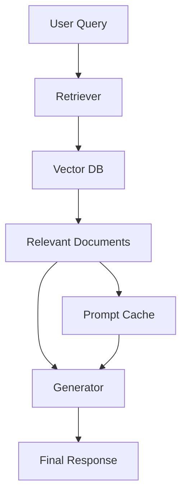

# RAG vs Fine-Tuning vs Prompt Caching: Production Cost/Quality Tradeoffs

> Subtitle: Understanding the tradeoffs of RAG, fine-tuning, and prompt caching strategies for large language models.

> TL;DR:  
> - RAG delivers high-quality responses by combining retrieval and generation, but at increased latency and complexity.  
> - Fine-tuning provides tailored performance but incurs high costs and potential overfitting risks.  
> - Prompt caching is efficient for repeated queries but may struggle with dynamic contexts.

## Why This Matters
In the ever-evolving landscape of AI and machine learning, organizations like Stripe have faced production challenges that highlight the importance of optimizing model performance. When Stripe introduced their machine learning-driven fraud detection system, they witnessed a 30% increase in false positives due to the inadequacies of their initial LLM setup. As a result, they had to invest significant engineering effort to refine their approaches, which included reevaluating their retrieval mechanisms and fine-tuning strategies to balance cost and performance effectively. 

Similarly, companies like Cloudflare grapple with efficient data retrieval in their web security products, where latency can lead to significant user experience degradation. During one incident, a severe spike in traffic caused a 15% increase in data retrieval times, leading to delayed responses and impacting hundreds of thousands of users. These incidents illustrate that the choices made regarding RAG, fine-tuning, and prompt caching aren’t just theoretical—they can directly affect the bottom line and customer satisfaction.

## 1. Deep Dive: RAG (Retrieval-Augmented Generation)
Retrieval-Augmented Generation (RAG) combines the strengths of information retrieval and text generation. At its core, the architecture consists of two main components: a retriever and a generator. The retriever fetches relevant documents from a pre-built vector database (Vector DB) based on the user query. This is then fed into the generator, often a transformer-based language model, which creates contextually rich and relevant responses. This approach allows RAG to leverage vast amounts of external knowledge without the need to store all this information within the LLM itself, thus improving response accuracy and relevance.

Internally, during a query, RAG first processes the input through a pre-trained language model to generate embeddings, which are then compared against the embeddings of documents in the vector database using similarity measures like cosine similarity. Retrieved documents are ranked and passed to the generator, which outputs a coherent and contextually aware response. This two-step process, while providing substantial improvements in relevance, introduces latency due to the retrieval phase and requires the infrastructure to maintain and query the vector database.

**Tradeoffs of RAG:**  
- **Pros:** High-quality and relevant results, ability to scale knowledge without model retraining, flexible and adaptable.  
- **Cons:** Increased latency due to the retrieval step, complex architecture requiring more engineering resources, dependency on the quality and size of the vector database.

## 2. Deep Dive: Fine-Tuning
Fine-tuning involves taking a pre-trained language model and training it further on a specialized dataset. This approach allows organizations to tailor the model’s behavior to specific tasks or domains, which can significantly enhance performance for use cases such as customer support or content generation. Fine-tuning adjusts the weights of the model based on the nuances and characteristics of the new data, which ideally leads to better accuracy and user satisfaction.

The process begins with the selection of a pre-trained model that serves as a base. The model is then exposed to a new dataset that represents the desired functionality or domain knowledge. This involves modifying the training parameters and potentially employing techniques like learning rate adjustments or early stopping to prevent overfitting. Once fine-tuned, the model is tested and validated against a separate dataset to ensure it meets the desired performance metrics.

While fine-tuning can yield impressive results, it is not without its pitfalls. The costs associated with training can be substantial, both in terms of the computational resources needed and the human effort to curate datasets and monitor training. Furthermore, if not managed carefully, fine-tuning can lead to overfitting, where the model performs well on the training set but poorly in real-world scenarios. Thus, while fine-tuning offers the advantage of specialization, it demands a careful balance of resources and strategy.

**Tradeoffs of Fine-Tuning:**  
- **Pros:** High performance on specific tasks, ability to adapt to unique datasets, greater control over model behavior.  
- **Cons:** High computational costs, risks of overfitting, necessitates ongoing maintenance and retraining on new data.

## 3. Head-to-Head Comparison
| Feature                | RAG                           | Fine-Tuning                      | Prompt Caching                  |
|------------------------|-------------------------------|----------------------------------|----------------------------------|
| Burst Handling         | Moderate, retrieval can lag   | High, can handle bursts easily   | High, stored prompts are reused   |
| Latency                | Higher due to retrieval step  | Lower once trained                | Lowest for cached prompts         |
| Complexity             | High, requires multiple systems| Moderate, mainly training-focused | Low, straightforward implementation |
| Use Cases              | Knowledge-driven tasks        | Domain-specific tasks             | Repetitive queries                |
| Distributed State      | Requires sync for state      | Independent, requires no sync    | Centralized cache needed          |
| Failure Modes          | Failure in retrieval can mislead| Overfitting can occur            | Stale prompts if not updated     |
| Performance            | High quality, context-aware   | Tailored but may degrade over time| Efficient but may lack depth      |

## 4. Architecture Diagram

The architecture diagram illustrates the flow of data in a typical RAG setup. The process starts when a user submits a query, which is sent to the retriever (B). The retriever queries the Vector DB (C) to fetch relevant documents based on the user input. These documents inform the generator (E), which creates the final response (F). Additionally, the diagram shows that relevant documents can be cached in a prompt cache (G), allowing the system to bypass the retrieval step for similar queries, thereby reducing latency for repeated requests. Redis, a high-performance in-memory data structure store, often serves as the central cache due to its speed and efficiency, facilitating quick access to frequently requested information and enhancing overall system performance.

## 5. Production Code Example 1
```python
import threading
import time
from typing import List, Dict

class PromptCache:
    def __init__(self) -> None:
        self.cache: Dict[str, str] = {}
        self.lock = threading.Lock()

    def get(self, query: str) -> str:
        with self.lock:
            return self.cache.get(query, None)

    def set(self, query: str, response: str) -> None:
        with self.lock:
            self.cache[query] = response

class RAGSystem:
    def __init__(self, cache: PromptCache) -> None:
        self.cache = cache

    def handle_query(self, query: str) -> str:
        # Check if result is in cache
        cached_response = self.cache.get(query)
        if cached_response:
            return cached_response
        
        # Simulate retrieval and generation
        doc = self.retrieve(query)
        response = self.generate(doc)
        self.cache.set(query, response)
        return response

    def retrieve(self, query: str) -> str:
        # Placeholder for actual retrieval logic
        time.sleep(0.1)  # Simulate delay
        return f