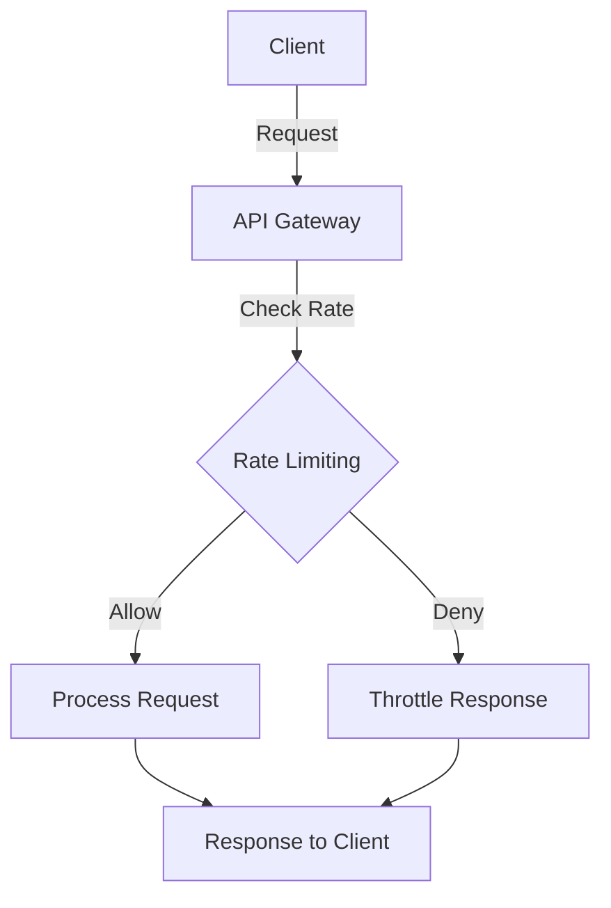

# Rate Limiting at Scale: Token Bucket vs Leaky Bucket vs Sliding Window — Lessons from Stripe & Cloudflare

Rate limiting is a crucial aspect of API design, especially in high-traffic systems. By controlling the rate of requests to an API, we can ensure fair use, optimize resource allocation, and protect back-end services from being overwhelmed. In this article, we will explore three popular rate-limiting algorithms: Token Bucket, Leaky Bucket, and Sliding Window, drawing lessons from industry leaders like Stripe and Cloudflare.

## TL;DR:
- Learn the differences between Token Bucket, Leaky Bucket, and Sliding Window algorithms for rate limiting.
- Discover how Stripe and Cloudflare implement these techniques to manage traffic effectively.
- Understand the trade-offs of each approach to make informed decisions for your systems.

## Why This Matters
In 2020, Stripe experienced a massive surge in API traffic due to an influx of new users during the pandemic. The company reported that the total payment volume processed rose by 48% year-over-year, stressing their APIs to a breaking point. To maintain performance and reliability, Stripe had to implement robust rate limiting to control the traffic and prevent service degradation. Similarly, Cloudflare, which handles an astronomical amount of data daily, relies on effective rate-limiting strategies to protect against DDoS attacks while ensuring legitimate traffic is not throttled. Their systems handle millions of requests per second, necessitating precise control mechanisms that can adapt to varying loads. This article will dissect the mechanics of these strategies, enabling you to apply similar principles to your own production systems.

## 1. Deep Dive: Token Bucket
The Token Bucket algorithm is designed to allow bursts of traffic while still enforcing an overall limit on the rate of requests over time. In this architecture, tokens are periodically added to a bucket at a fixed rate, and each incoming request requires a token to be processed. If the bucket is full, any additional tokens are discarded, and if it’s empty, incoming requests are throttled until new tokens are added. This approach allows for short bursts of traffic while adhering to a defined average rate. 

### Internal Mechanics
1. **Token Generation**: Tokens are added to the bucket at a specified rate (e.g., one token every second). The bucket has a maximum capacity which dictates how many tokens can be held at once.
2. **Request Processing**: Each request checks if a token is available. If so, it consumes one token and processes the request; if not, the request is denied or queued.
3. **Burst Handling**: Because the bucket can hold multiple tokens, this architecture allows for burst traffic without immediate denial of service.
4. **Concurrency**: In distributed systems, token generation and consumption must be carefully synchronized to prevent race conditions, often using atomic operations or distributed locks.

### Trade-offs
- **Pros**: Allows bursts of traffic, easy to implement, and accommodates different average rates.
- **Cons**: Can lead to throttling during sustained high traffic if tokens run out, and implementation complexity increases in distributed systems.

## 2. Deep Dive: Leaky Bucket
The Leaky Bucket algorithm offers a different approach, focusing on a steady flow of requests rather than bursts. In this case, incoming requests are queued in a bucket, which leaks at a constant rate. Once the bucket is full, any additional incoming requests are discarded until there is space in the bucket. This ensures that rate limits are strictly adhered to over time, preventing any sudden spikes in traffic.

### Internal Mechanics
1. **Queueing**: All incoming requests are placed in a queue (the bucket). Requests wait here until they can be processed.
2. **Constant Outflow**: Requests are processed at a fixed rate, regardless of how many requests are queued, which helps maintain a consistent load on the system.
3. **Full Bucket Handling**: If the bucket (queue) is full, incoming requests are dropped. This prevents overflow and keeps the system stable.
4. **Scalability**: This architecture is simpler in terms of implementation compared to Token Bucket, but it can lead to increased latency during high traffic periods as requests are queued.

### Trade-offs
- **Pros**: Enforces a strict rate limit, simpler implementation, and predictable performance.
- **Cons**: Does not allow burst traffic, can result in increased latency, and can lead to high drop rates during traffic spikes.

## 3. Head-to-Head Comparison
| Feature              | Token Bucket                          | Leaky Bucket                           | Sliding Window                 |
|----------------------|---------------------------------------|---------------------------------------|----------------------------------|
| Burst Handling       | Allows bursts of traffic              | No burst handling, constant leakage    | Moderate burst handling         |
| Latency              | Low latency under normal conditions   | Higher latency during bursts         | Moderate latency                 |
| Complexity           | More complex due to synchronization   | Simpler to implement                  | Moderate complexity              |
| Use Cases            | APIs with sporadic traffic patterns   | APIs requiring strict limits         | APIs with variable traffic       |
| Distributed State    | Requires distributed synchronization   | Can be easier to distribute         | Requires coordination             |
| Failure Modes        | Tokens can run out                    | Requests can be dropped              | Complexity can lead to inconsistency |
| Performance          | High performance with bursts          | Limited performance under high load   | Good performance with averaging   |

## 4. Architecture Diagram


In this architecture diagram, we see a simple flow of how rate limiting integrates with an API Gateway. The client sends a request to the API Gateway, which is responsible for checking the rate limits defined by the rate-limiting algorithm (Token Bucket, Leaky Bucket, or Sliding Window). If the request is allowed, it is passed to the processing layer, where the actual business logic occurs. If the request exceeds the allowed rate, the API Gateway denies the request and sends a throttle response back to the client. Redis is central in this architecture as it offers fast in-memory data storage for maintaining the state of tokens or request counts, ensuring low-latency access and high throughput, especially in distributed systems.

## 5. Production Code Example 1: Token Bucket
```python
def __init__(self, rate: float, capacity: int):
    self.capacity = capacity
    self.tokens = capacity  # initially full
    self.rate = rate  # tokens added per second
    self.last_checked = time.monotonic()
    self.lock = threading.Lock()

def add_token(self):
    now = time.monotonic()
    elapsed = now - self.last_checked
    self.last_checked = now
    new_tokens = elapsed * self.rate
    self.tokens = min(self.capacity, self.tokens + new_tokens)

def allow_request(self) -> bool:
    with self.lock:
        self.add_token()  # update token count
        if self.tokens > 0:
            self.tokens -= 1  # consume a token
            return True
    return False
```

The `TokenBucket` class manages the rate-limiting logic. The `__init__` method initializes the bucket's capacity and the rate of token generation. The `add_token` method calculates the number of tokens that should have been added based on the elapsed time since the last check, ensuring that tokens are generated at the correct rate. The `allow_request` method checks if a token is available. If so, it consumes a token and allows the request; otherwise, the request is denied. This implementation also considers thread safety using a `Lock`, which is essential in a multi-threaded environment to prevent race conditions when accessing shared resources. Clock skew must be handled by using a high-resolution timer. The method accommodates burst traffic by allowing multiple requests as long as there are tokens available.

## 6. Production Code Example 2: Leaky Bucket
```python
def __init__(self, leak_rate: float, capacity: int):
    self.capacity = capacity
    self.queue = Queue(maxsize=capacity)
    self.leak_rate = leak_rate  # requests processed per second
    self.last_leak = time.monotonic()

def leak_bucket(self):
    now = time.monotonic()
    elapsed = now - self.last_leak
    leaked = int(elapsed * self.leak_rate)
    for _ in range(min(leaked, self.queue.qsize())):
        self.queue.get_nowait()  # process requests from the queue
    self.last_leak = now

def add_request(self) -> bool:
    self.leak_bucket()  # process requests first
    try:
        self.queue.put_nowait(1)  # add request to the queue
        return True
    except Full:
        return False  # queue is full
```

In the `LeakyBucket` class, the `__init__` method sets up the queue's capacity and the rate of request processing. The `leak_bucket` method processes requests from the queue at the defined leak rate, ensuring that the system adheres to a constant flow. The loop dequeues requests from the queue based on how many requests should have been processed since the last check. The `add_request` method first calls `leak_bucket` to ensure that expired requests are processed and then attempts to add a new request to the queue. If the queue is full, it returns a denial status. This implementation maintains strict control over the request flow, preventing sudden spikes in traffic.

## 7. Real-World Use Cases
1. **Stripe**: Stripe utilizes rate limiting to manage API requests effectively, allowing businesses to handle peak traffic without degrading service. Their use of the Token Bucket algorithm enables clients to burst while keeping an average rate under control, which is particularly useful during sales or promotional events.

2. **Cloudflare**: Cloudflare employs the Leaky Bucket algorithm to protect its network from DDoS attacks while ensuring legitimate users access their services. This approach helps maintain service availability without sudden drops in performance, crucial for their global user base.

3. **Netflix**: Netflix uses a combination of these algorithms to manage streaming requests, adapting dynamically based on user behavior. The Sliding Window algorithm is particularly beneficial here, as it allows for flexible rate limits that can accommodate varying user demands throughout the day.

## 8. Failure Modes & Pitfalls
- **Token Exhaustion**: In a Token Bucket system, if tokens run out during high traffic, it may lead to request denial. To mitigate this, strategies like token replenishment prioritization for critical services can be implemented.
- **Queue Overflow**: In a Leaky Bucket system, if the queue becomes full, legitimate requests may be dropped. Implementing backoff strategies or alerting mechanisms can help manage this.
- **Latency**: Both algorithms can introduce latency; careful tuning of the parameters is required to balance throughput and responsiveness. Employing metrics to monitor this can provide insights.
- **Clock Skew**: In distributed environments, clock differences can cause discrepancies in token generation or request processing. Using a distributed time source like NTP can help synchronize clocks across servers.

## 9. When to Choose Which
Choosing the right rate-limiting strategy often depends on your specific use case and traffic patterns. If your API experiences variable traffic and you want to allow bursts, the Token Bucket may be the best fit. On the other hand, if your system needs to maintain a steady load and cannot accommodate sudden spikes, the Leaky Bucket is more appropriate. Sliding Window is ideal for systems where a flexible approach to rate limiting is required, allowing for bursts within defined time windows. Assessing your application's behavior and user patterns will guide your choice effectively.

## Conclusion
Rate limiting is a critical component of modern API design that can significantly impact performance, reliability, and user experience. By understanding the nuances of Token Bucket, Leaky Bucket, and Sliding Window algorithms, you can make informed decisions for your architecture. Key takeaways include:
- **Understand the trade-offs**: Each algorithm has its strengths and weaknesses; choose based on traffic patterns.
- **Monitor performance**: Continuously track the performance of your rate limiting to adjust parameters accordingly.
- **Implement fail-safes**: Prepare for edge cases and ensure your system can handle unexpected spikes in traffic.
  
With these insights, you can optimize your API's performance and ensure a seamless experience for your users.

---
### References
- Stripe API Documentation
- Cloudflare Rate Limiting Overview
- Netflix Tech Blog on Rate Limiting Strategies
